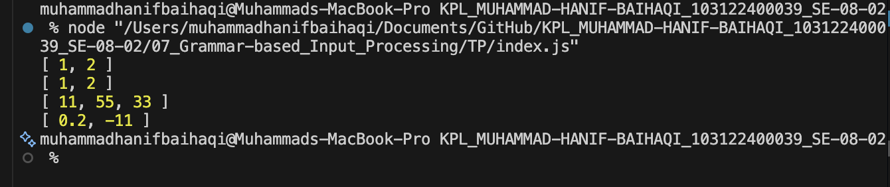

# Tugas Pendahuluan : Grammar-based Input Processing

MUHAMMAD HANIF BAIHAQI

103122400039

SE-08-02

Dosen Pengampu : Yudha Islami Sulistya

Asisten Praktikum : Ardiansyah Muhammad Pradana Farawowan, dan Hamid Khaeruman 

## Sumber Kode
Tersedia di [index.js](index.js)

## Output

## Deskripsi
Function toNumberArray() digunakan untuk mengubah input berupa string atau array menjadi array angka (number array). Jika input berbentuk string, data akan dipisahkan berdasarkan tanda koma menggunakan split(). Setelah itu, setiap elemen diubah menjadi tipe data number menggunakan parseFloat(). Function juga melakukan validasi dengan filter() dan isNaN() untuk menghapus nilai yang tidak valid atau bukan angka. Dengan demikian, output yang dihasilkan hanya berisi data numerik yang valid, baik integer maupun desimal.

Fungsi ini dirancang untuk menerima dua jenis input, yaitu:

1. String yang berisi angka-angka yang dipisahkan oleh tanda koma (,), misalnya "1, 2, 3".
2. Array of string, misalnya ["1", "2", "3"].

