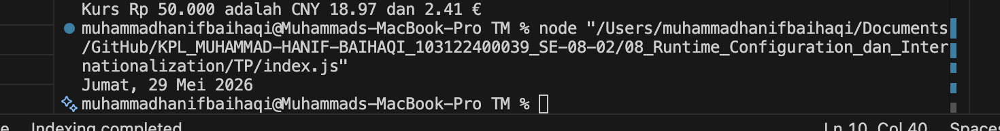

# Tugas Pendahuluan : Runtime Configuration dan Internationalization

**Nama** : MUHAMMAD HANIF BAIHAQI

**NIM** : 103122400039 

**Kelas** : SE-08-02  

Dosen Pengampu : Yudha Islami Sulistya

Asisten Praktikum : Ardiansyah Muhammad Pradana Farawowan, dan Hamid Khaeruman 

## Sumber Kode
Tersedia di [index.js](index.js)

## Output

## Deskripsi
`Intl.DateTimeFormat` digunakan untuk mengubah objek `Date` menjadi format tanggal dan waktu yang lebih mudah dipahami oleh pengguna. Dengan fitur ini, format tanggal bawaan JavaScript dapat ditampilkan dalam bentuk yang lebih informatif dan sesuai dengan lokal tertentu, misalnya seperti `"Jumat, 29 Mei 2026"` atau `"Jumat, 29 Mei 2026 pukul 21.40 WIB"`.

Penggunaan opsi seperti `dateStyle` dan `timeStyle` memungkinkan pengembang untuk mengatur tingkat detail informasi tanggal dan waktu, seperti `full`, `long`, `medium`, maupun `short`. Selain itu, properti seperti `weekday`, `year`, `month`, dan `day` dapat digunakan untuk melakukan penyesuaian format secara lebih spesifik sesuai kebutuhan aplikasi atau sistem yang dikembangkan.
