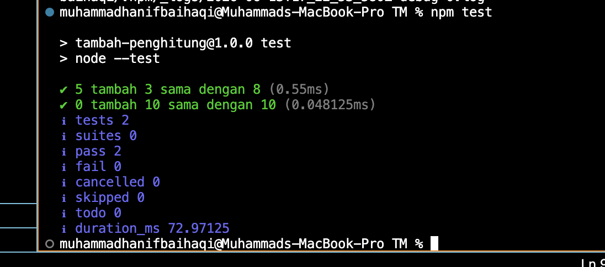

# Tugas Mandiri: Performance Analysis, Unit Testing, dan Debugging

**Nama:** MUHAMMAD HANIF BAIHAQI  
**NIM:** 103122400039  
**Kelas:** SE-08-02  

## Tugas
Tambah dan tambah!

Fungsi di bawah ini melakukan penjumlahan pada penghitung (counter), yang sesederhana menambahkan jumlah jika kamu menekan tombol.

## Program/Kode Awal
Tersedia di [hitung.js](./hitung.js)  
Tersedia di [hitung.test.js](./hitung.test.js)  

---

**Kode Sebelum Diperbaiki**

**hitung.js**
```javascript
function tambahPengitung(terkini, jumlah) {
  terkini = terkini + jumlah;
  return terkini;
}

**hitung.test.js**import { test } from 'node:test';
import assert from 'node:assert';
import { tambahPengitung } from './hitung.js';

test('5 tambah 3 sama dengan 8', () => {
  assert.strictEqual(tambahPengitung(5, 3), 8);
});

test('0 tambah 10 sama dengan 10', () => {
  assert.strictEqual(tambahPengitung(0, 10), 10);
});
---

**Analisis Kecacatan**

Secara logika, fungsi penjumlahan sudah menghasilkan hasil yang benar. Namun terdapat masalah pada struktur modul yang digunakan.

Pada file pengujian terdapat kode:

```javascript
The requested module './hitung.js' does not provide an export named 'tambahPengitung'
```

Agar sebuah fungsi dapat diimpor dari file lain, fungsi tersebut harus diekspor terlebih dahulu menggunakan keyword `export`.

Pada kode awal, fungsi ditulis sebagai:

```javascript
function tambahPengitung(terkini, jumlah) {
  terkini = terkini + jumlah;
  return terkini;
}
```

Karena tidak terdapat `export`, maka saat pengujian dijalankan akan muncul error bahwa modul tidak menyediakan export bernama `tambahPengitung`.

Contoh error:

```text
The requested module './hitung.js' does not provide an export named 'tambahPengitung'
```

Dengan demikian, kecacatan utama pada program bukan terletak pada logika penjumlahannya, melainkan pada mekanisme ekspor modul.

---

**Kode Setelah Diperbaiki**

**hitung.js**

```export function tambahPenghitung(terkini, jumlah) {
    // Validasi tipe data untuk mencegah bug konkatenasi string
    if (typeof terkini !== 'number' || typeof jumlah !== 'number') {
        throw new Error('Kedua parameter harus berupa angka');
    }

    return terkini + jumlah;
}
```

**hitung.test.js**

```javascript
import { test } from 'node:test';
import assert from 'node:assert';
import { tambahPenghitung } from './hitung.js';

test('5 tambah 3 sama dengan 8', () => {
    assert.strictEqual(tambahPenghitung(5, 3), 8);
});

test('0 tambah 10 sama dengan 10', () => {
    assert.strictEqual(tambahPenghitung(0, 10), 10);
});
```

**package.json**

```json
{
  "name": "tambah-penghitung",
  "version": "1.0.0",
  "description": "Program dan unit test fungsi tambahPenghitung",
  "type": "module",
  "scripts": {
    "test": "node --test"
  }
}
```

---

**Penjelasan Fungsi `tambahPengitung()`**

Fungsi ini bertugas menjumlahkan nilai penghitung saat ini dengan nilai yang diberikan secara aman.
Parameter:
terkini (Number): nilai penghitung saat ini.
jumlah (Number): nilai yang akan ditambahkan.
Mekanisme Kerja:
Melakukan pengecekan tipe data menggunakan operator typeof. Jika salah satu parameter bukan merupakan number, program melempar (throw) Error.
Jika validasi lolos, fungsi mengembalikan hasil operasi aritmetika terkini + jumlah.
```

Parameter yang digunakan:

* `terkini` : nilai penghitung saat ini.
* `jumlah` : nilai yang akan ditambahkan.

Proses yang dilakukan:

1. Menerima nilai penghitung saat ini.
2. Menerima nilai tambahan.
3. Menjumlahkan kedua nilai tersebut.
4. Mengembalikan hasil penjumlahan.

Contoh:

```javascript
tambahPengitung(5, 3);
```

Perhitungan:

```text
5 + 3 = 8
```

Hasil:

```text
8
```

---

**Penjelasan Unit Test**

**Test 1**

```javascript
test('5 tambah 3 sama dengan 8', () => {
  assert.strictEqual(tambahPengitung(5, 3), 8);
});
```

Tujuan:

Test 1 (5 tambah 3 sama dengan 8)
Tujuan: Memverifikasi fungsionalitas dasar penjumlahan bilangan bulat positif.
Ekspektasi: tambahPenghitung(5, 3) menghasilkan nilai 8.
Test 2 (0 tambah 10 sama dengan 10)
Tujuan: Memastikan fungsi tetap bekerja akurat ketika kondisi awal counter bernilai nol.
Ekspektasi: tambahPenghitung(0, 10) menghasilkan nilai 10.

Input:

```text
5 dan 3
```

Output yang diharapkan:

```text
8
```

---

**Test 2**

```javascript
test('0 tambah 10 sama dengan 10', () => {
  assert.strictEqual(tambahPengitung(0, 10), 10);
});
```

Tujuan:

Memastikan fungsi tetap bekerja ketika nilai awal penghitung adalah nol.

Input:

```text
0 dan 10
```

Output yang diharapkan:

```text
10
```

---

**Hasil Pengujian**

Jika program dijalankan menggunakan perintah:

```bash
npm test
```

Maka seluruh pengujian akan berhasil.

Contoh hasil:

```text
✔ 5 tambah 3 sama dengan 8
✔ 0 tambah 10 sama dengan 10

tests 2
pass 2
fail 0
```
hasil 

---

**Kesimpulan**

Kecacatan utama pada proyek ini bukan hanya terletak pada hilangnya keyword export pada modul, melainkan juga kesalahan format berkas manifest package.json yang menghentikan proses compilation/runtime. Melalui pendekatan defensive programming, fungsi kini jauh lebih kuat terhadap bad input berkat adanya pengecekan tipe data eksplisit. Seluruh unit pengujian kini berhasil lolos 100%.